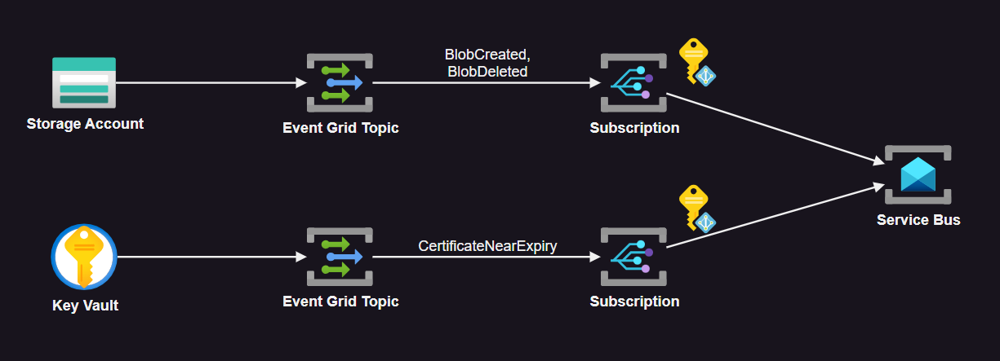

# Azure Event Grid

Subscribing to Azure system events with Event Grid.



Create the resource:

```sh
terraform init
terraform apply -auto-approve
```

As per Microsoft recent recommendations, implemented using [CloudEvent][1] schema.

To force trigger the topic, upload a blob file:

```sh
az storage blob upload \
    --account-name <storage-account> \
    --container-name blobs \
    --name blob.txt \
    --file blob.txt \
    --auth-mode login
```

A message will be pushed to the Service Bus queue.

Event Grid topic subscriptions allows for more advanced controls, such as:

- Filters (Subject and Advanced)
- Dead-lettering
- Retry policies
- Expiration time
- Delivery headers

[1]: https://learn.microsoft.com/en-us/azure/event-grid/cloud-event-schema
